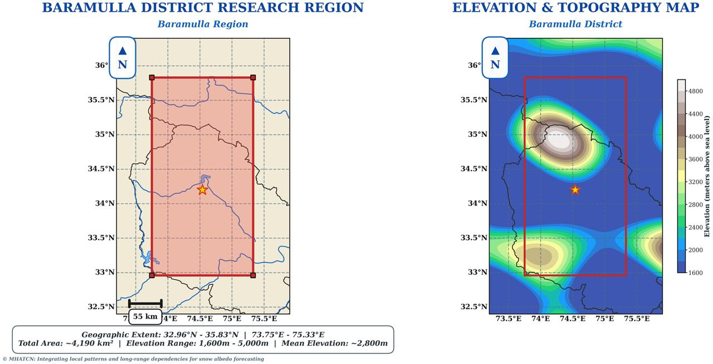
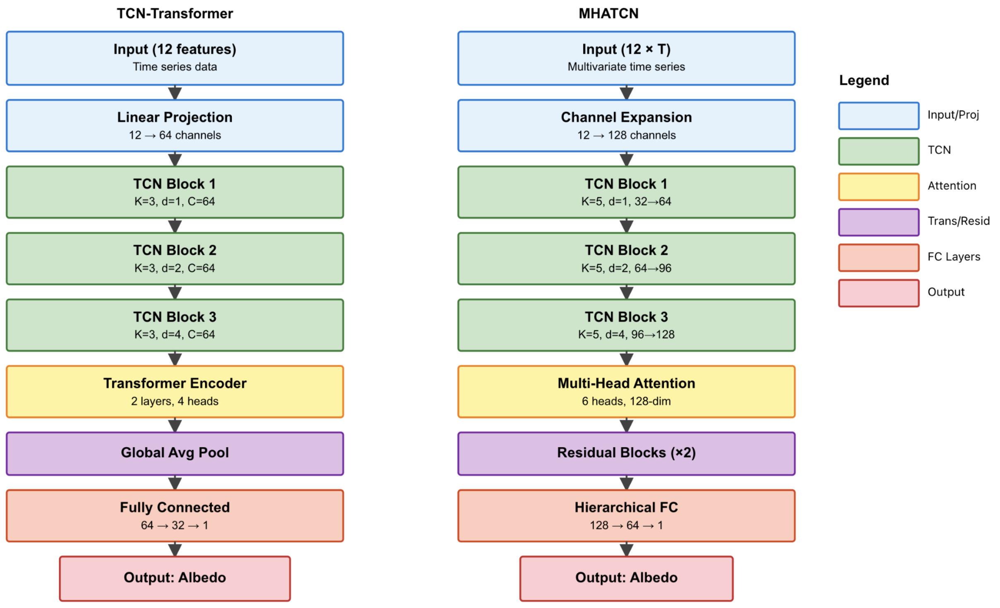
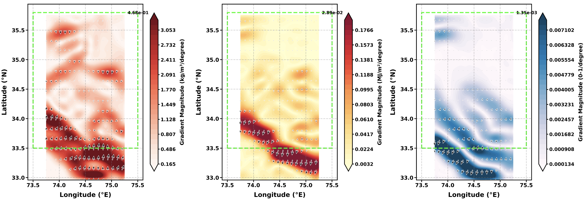

# MHATCN: Integrating Local Patterns and Long-Range Dependencies for Snow Albedo Forecasting

---

## Authors

**Rampunit Kumar**¹, **Aman Kumar Meena**², **Alok Saw**¹, and **Divesh Kumar**³

¹ Independent Researcher, Bengaluru, India  
² Energy, Environment and Water Research Centre, The Cyprus Institute, Aglantzia, Lefkosia, Cyprus  
³ Department of General Management, National Institute of Technology, Tiruchirappalli, Tamil Nadu, India

---

## Abstract

Snow albedo plays a critical role in regulating surface energy balance and climate processes, particularly in complex mountainous environments like Himalayans. However, existing snow albedo prediction approaches often struggle to simultaneously capture short-term variability and long-range temporal dependencies. They also frequently place limited emphasis on physical interpretability and systematic evaluation of model robustness across varying meteorological and spatial conditions.

To address these limitations, this study enhances an existing Temporal Convolutional Network (TCN) framework by integrating multi-head attention mechanism, and applies the improved architecture to snow albedo prediction in the Baramulla district of Jammu and Kashmir. The model is trained using high-resolution ERA5-Land reanalysis data from the European Centre for Medium-Range Weather Forecasts (ECMWF), covering the winter months (January–February) from 2019 to 2021.

The dataset comprises 1,982,208 observations, including skin temperature, snow density, surface solar radiation, and evaporation. By combining temporal convolutional blocks with multi-head attention mechanisms, the proposed architecture effectively captures both local temporal patterns and long-range dependencies in snow–atmosphere interactions.

---

## Study Area

**Figure 1.** Administrative boundaries of Indian states with the location of the Baramulla district (left), the digital elevation model highlighting the pronounced elevation gradient (centre), and location with respect to India (right).

The study focuses on the Baramulla district in Jammu and Kashmir, a region characterized by complex topography and significant elevation gradients. This mountainous terrain presents unique challenges for snow albedo modeling due to variable meteorological conditions and intricate snow-atmosphere interactions.

---

## Model Architecture

**Figure 2.** Architecture comparison between TCN-Transformer baseline (left) and proposed MHATCN model (right). Baseline uses simple global average pooling after transformer encoder, while MHATCN uses progressive channel expansion in TCN blocks followed by multi-head attention and residual blocks.

### Key Architectural Components

**Temporal Convolutional Network (TCN) Blocks**
- Progressive channel expansion for hierarchical feature extraction
- Dilated causal convolutions for capturing temporal patterns
- Residual connections for improved gradient flow

**Multi-Head Attention Mechanism**
- Captures long-range temporal dependencies
- Enables the model to focus on relevant time steps
- Improves interpretability of temporal relationships

**Integration Strategy**
- TCN blocks extract local temporal patterns
- Multi-head attention identifies long-range dependencies
- Residual blocks enhance model stability and performance

---

## Dataset

### Data Source
High-resolution ERA5-Land reanalysis data from ECMWF

### Temporal Coverage
Winter months (January–February) spanning 2019–2021

### Dataset Size
1,982,208 observations

### Input Variables
- Skin temperature
- Snow density
- Surface solar radiation
- Evaporation

### Target Variable
Snow albedo

---

## Performance Metrics

The enhanced MHATCN framework demonstrates superior performance compared to the baseline TCN–Transformer model:

| Metric | MHATCN Performance |
|--------|-------------------|
| RMSE | 0.029 |
| MAE | 0.018 |
| R² | 0.873 |
| MAPE | 2.56% |

These results indicate improved predictive accuracy and robustness across varying meteorological and spatial conditions.

---

## Key Findings

### Model Performance
- The MHATCN architecture outperforms baseline TCN–Transformer models across all evaluation metrics
- Achieved high coefficient of determination (R² = 0.873), indicating strong explanatory power
- Low error rates (RMSE = 0.029, MAE = 0.018) demonstrate accurate predictions
- Minimal percentage error (MAPE = 2.56%) confirms model reliability

### Physical Relationships Identified
- **Temperature**: Quadratic relationship with snow albedo, reflecting complex thermodynamic processes
- **Solar Radiation**: Inverse linear trend, consistent with radiative transfer theory
- **Strong correlations**: Identified between snow albedo and key meteorological variables

### Spatial Patterns

**Figure 7.** Spatial distribution of gradient magnitudes for skin temperature (a), surface net solar radiation (b), and evaporation (c) across study regions. Temperature gradients show maximum values exceeding 4.68 K/degree in northern sections, while solar radiation gradients peak at 2.89 MJ/m²/degree, and evaporation gradients reach 1.35 mm/degree.

The spatial analysis reveals:
- Maximum temperature gradients exceeding 4.68 K/degree in northern sections
- Solar radiation gradients peaking at 2.89 MJ/m²/degree
- Evaporation gradients reaching 1.35 mm/degree
- Significant spatial heterogeneity reflecting complex terrain influences

---

## Methodological Contributions

### Enhanced Temporal Modeling
The integration of TCN and multi-head attention mechanisms enables:
- Simultaneous capture of short-term variability and long-range dependencies
- Improved handling of temporal sequences in meteorological data
- Better representation of snow-atmosphere interaction dynamics

### Physical Interpretability
The model architecture facilitates:
- Understanding of feature importance through attention weights
- Identification of critical temporal relationships
- Physical validation of learned patterns

### Robustness Evaluation
Systematic assessment across:
- Varying meteorological conditions
- Different spatial locations
- Multiple temporal scales
- Diverse snow cover scenarios

---

## Implementation

### Data Analysis Notebook
Comprehensive exploratory data analysis, statistical summaries, and spatial visualization.

### Model Implementation Notebook
Complete model architecture, training procedures, evaluation metrics, and result visualization.

---

## Dependencies

### Core Requirements
- Python 3.8+
- PyTorch 1.10+
- NumPy
- Pandas
- Matplotlib
- Seaborn

### Data Processing
- xarray
- netCDF4
- scipy

### Deep Learning
- torch
- torchvision
- tensorboard

### Geospatial Analysis
- cartopy
- geopandas
- rasterio

---

## Applications

### Climate Modeling
- Improved representation of surface energy balance in climate models
- Enhanced understanding of snow-atmosphere feedback mechanisms
- Better prediction of seasonal snowmelt timing

### Water Resource Management
- Accurate snowmelt forecasting for reservoir management
- Improved water availability predictions
- Enhanced drought preparedness planning

### Disaster Risk Reduction
- Early warning systems for avalanche risk
- Flood forecasting from rapid snowmelt events
- Climate change impact assessment

### Remote Sensing
- Validation of satellite-derived snow albedo products
- Calibration of radiative transfer models
- Gap-filling in observational datasets

---

## Keywords

Snow albedo • Deep learning • Temporal convolutional networks • Multi-head attention • Himalayan region • Climate modeling • ERA5-Land • Time series forecasting • Surface energy balance • Machine learning

---

## Future Work

### Model Extensions
- Integration of additional meteorological variables
- Multi-task learning for simultaneous prediction of related variables
- Transfer learning to other snow-covered regions

### Spatial Scale Analysis
- Application to larger geographical domains
- Assessment of model performance across different elevations
- Investigation of aspect and slope effects

### Temporal Resolution
- Evaluation at sub-daily time scales
- Seasonal prediction capabilities
- Long-term climate projection scenarios

### Physical Constraints
- Incorporation of energy balance constraints
- Integration with radiative transfer models
- Coupling with hydrological models

---

## Contact Information

For questions, collaborations, or data requests, please contact:

**Rampunit Kumar**  
Independent Researcher, Bengaluru, India  
Email: [kumar.191@iitj.ac.in]

---

## Acknowledgments

We acknowledge the European Centre for Medium-Range Weather Forecasts (ECMWF) for providing ERA5-Land reanalysis data through the Copernicus Climate Change Service (C3S). We also thank the open-source community for developing and maintaining the software tools used in this research.

---

## Discussion
## Reproducibility

The complete model implementation and training pipeline are publicly available via Google Colab:

## Model Overview

MHATCN combines Temporal Convolutional Networks (TCN) with Multi-Head Attention mechanisms for snow albedo prediction using ERA5-Land reanalysis data.

## Key Results

- 8.1% improvement in RMSE over baseline
- 14.3% improvement in MAE over baseline
- Coefficient of variation: 2.08% across seeds (42 and 123)

## Data

ERA5-Land reanalysis data provided by ECMWF via the Copernicus Climate Change Service (C3S).

## Acknowledgements

We acknowledge ECMWF for providing ERA5-Land reanalysis data through C3S. We also thank the open-source community for developing and maintaining the software tools used in this research.

## Version History

- **v1.0.0** (2024) - Initial release with complete implementation and analysis for 2019-2021 winter seasons

---

**Note**: This research represents ongoing work in snow albedo modeling using advanced deep learning techniques. Results and methodologies are subject to refinement based on peer review and additional validation studies.

---

*Last updated: December 2025*
